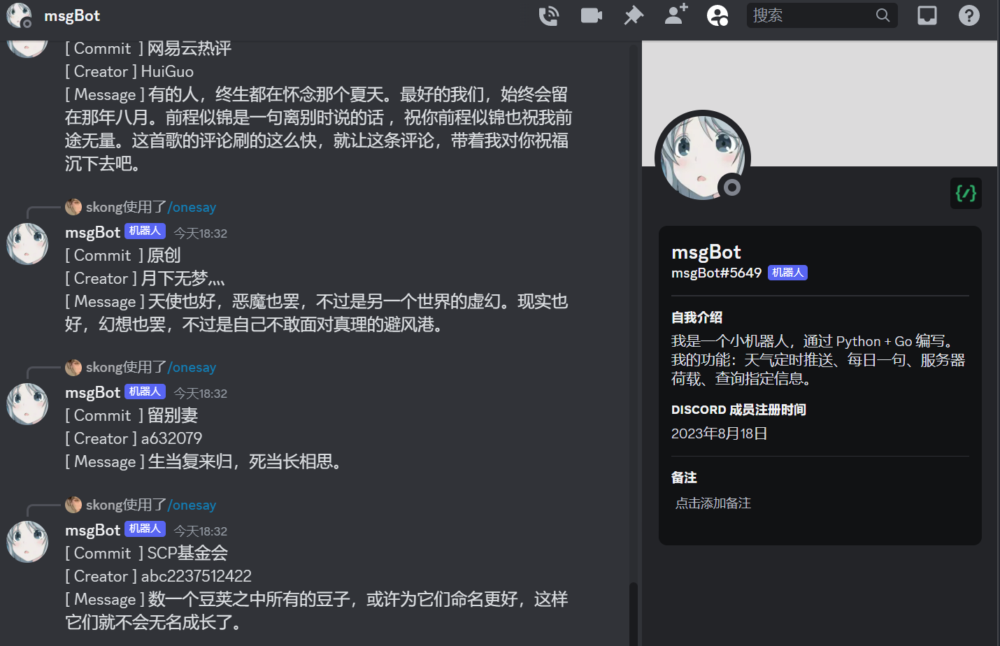
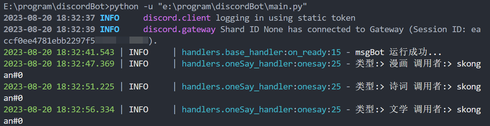
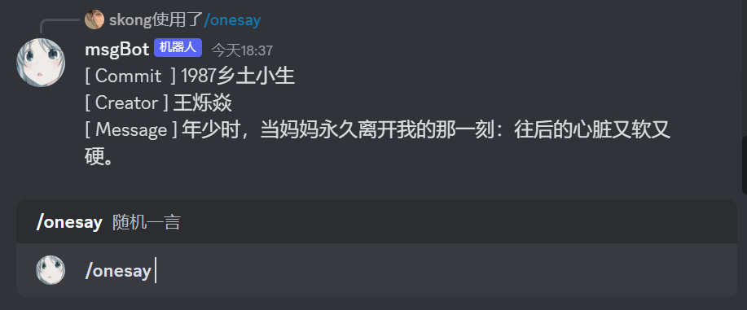

# Discord_demo

> msgBot 一个 demo 级案例



## 使用

> msgBot/config/config.json 中填写 token
>
> 国内 win 下开发需要设置 proxy

1. 安装依赖

   ```bash
   pip install discord.py
   py main.py
   ```

2. 运行成功 (gateway 显示 Session ID 代表运行成功)

   

3. 同步服务器

   ```bash
   !synccommands
   ```

   

4. 命令反馈

   

## 实现

- ping '/ping'
- 随机一言 '/onesay'
- 同步官方命令 '!synccommands'

## 感谢

- [Discord.py](https://github.com/Rapptz/discord.py)
- [大佬讲解](https://www.bilibili.com/video/BV1Wp4y1V7Zg/?spm_id_from=333.337.top_right_bar_window_history.content.click)
